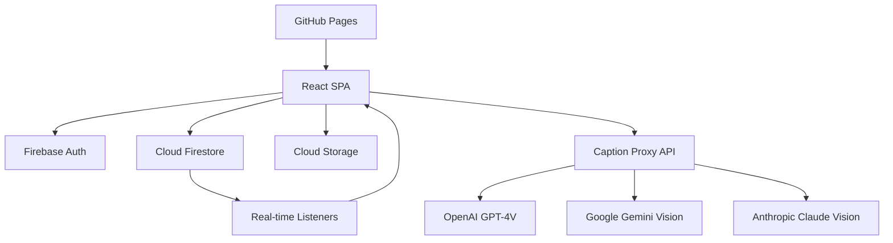

# Design Document

## Overview

The LoRa Dataset Builder is a React-based single-page application that provides a streamlined workflow for creating machine learning datasets. The application uses Firebase as a Backend-as-a-Service (BaaS) solution, with a serverless proxy layer for AI vision model integration. The architecture prioritizes real-time updates, anonymous user experience, and scalable image processing.

## Architecture

### High-Level Architecture



### Component Architecture

The application follows a component-based architecture with clear separation of concerns:

- **Presentation Layer**: React components with Tailwind CSS styling
- **State Management**: React hooks with Firestore real-time listeners
- **Business Logic**: Custom hooks for Firebase operations and caption orchestration
- **Data Layer**: Firebase services (Auth, Firestore, Storage)
- **External Integration**: Serverless proxy for AI vision models

## Components and Interfaces

### Core Components

#### 1. App Component
- Root component managing authentication state
- Initializes Firebase services
- Provides global error boundary and toast notifications

#### 2. UploadZone Component
```typescript
interface UploadZoneProps {
  onFilesSelected: (files: FileList) => void;
  isUploading: boolean;
  progress: number;
}
```
- Handles drag-and-drop and click-to-upload interactions
- Displays global progress for batch operations
- Validates file types and sizes

#### 3. GalleryGrid Component
```typescript
interface GalleryGridProps {
  images: ImageDoc[];
  onImageUpdate: (imageId: string, updates: Partial<ImageDoc>) => void;
  onImageDelete: (imageId: string) => void;
}
```
- Responsive CSS Grid layout
- Real-time updates via Firestore listeners
- Manages image card rendering and interactions

#### 4. ImageCard Component
```typescript
interface ImageCardProps {
  image: ImageDoc;
  onUpdate: (updates: Partial<ImageDoc>) => void;
  onDelete: () => void;
  onRegenerate: (providers?: string[]) => void;
}
```
- Displays image preview and caption candidates
- Handles caption selection and editing
- Manages per-image status and actions

#### 5. CaptionSelector Component
```typescript
interface CaptionSelectorProps {
  candidates: CaptionCandidate[];
  selectedIndex: number | null;
  onSelectionChange: (index: number) => void;
  selectedTextOverride?: string;
  onTextChange: (text: string) => void;
}
```
- Radio button selection for caption candidates
- Editable textarea for selected caption
- Provider identification and metadata display

#### 6. Toolbar Component
```typescript
interface ToolbarProps {
  images: ImageDoc[];
  showDownloadButton: boolean;
  onExport: () => void;
}
```
- Export functionality with localStorage gating
- Batch operations and statistics display

### Service Interfaces

#### 1. Firebase Services
```typescript
interface FirebaseService {
  auth: Auth;
  firestore: Firestore;
  storage: FirebaseStorage;
}

interface ImageService {
  uploadImage(file: File, userId: string): Promise<ImageDoc>;
  deleteImage(imageId: string, userId: string): Promise<void>;
  updateImage(imageId: string, updates: Partial<ImageDoc>): Promise<void>;
  subscribeToImages(userId: string, callback: (images: ImageDoc[]) => void): () => void;
}
```

#### 2. Caption Orchestrator
```typescript
interface CaptionOrchestrator {
  generateCaptions(image: ImageDoc, providers: ProviderConfig[]): Promise<void>;
  regenerateCaptions(imageId: string, providers?: string[]): Promise<void>;
}

interface ProviderConfig {
  id: string;
  endpoint: string;
  enabled: boolean;
  timeout: number;
}

interface VisionProvider {
  id: string;
  callProvider(imageUrl: string, options?: any): Promise<CaptionResult>;
}

interface CaptionResult {
  modelId: string;
  caption: string;
  latency: number;
  tokensUsed?: number;
  error?: string;
}
```

#### 3. Export Service
```typescript
interface ExportService {
  generateDataset(images: ImageDoc[]): DatasetEntry[];
  downloadDataset(dataset: DatasetEntry[], filename: string): void;
}

interface DatasetEntry {
  url: string;
  filename: string;
  caption: string;
}
```

## Data Models

### Firestore Schema

#### ImageDoc Collection: `users/{userId}/images/{imageId}`
```typescript
interface ImageDoc {
  id: string;
  filename: string;
  storagePath: string;       // gs://bucket/path
  downloadURL: string;       // https://... signed URL
  base64?: string;           // optional, for small images
  status: 'pending' | 'processing' | 'complete' | 'error';
  error?: string;
  candidates: CaptionCandidate[];
  selectedIndex: number | null;
  selectedTextOverride?: string;
  createdAt: number;         // epoch milliseconds
  updatedAt: number;
}

interface CaptionCandidate {
  modelId: string;           // e.g., "openai:gpt-4o-mini"
  caption: string;
  createdAt: number;
  latencyMs?: number;
  tokensUsed?: number;
  error?: string;
}
```

#### UserSettings Collection: `users/{userId}/settings`
```typescript
interface UserSettings {
  showDlButton: boolean;     // mirrors localStorage
  preferences?: {
    defaultProviders: string[];
    autoRegenerate: boolean;
  };
}
```

### Storage Layout
```
uploads/{userId}/{imageId}/{filename}
```

### Security Rules

#### Firestore Rules
```javascript
rules_version = '2';
service cloud.firestore {
  match /databases/{database}/documents {
    match /users/{userId}/{document=**} {
      allow read, write: if request.auth != null && request.auth.uid == userId;
    }
  }
}
```

#### Storage Rules
```javascript
rules_version = '2';
service firebase.storage {
  match /b/{bucket}/o {
    match /uploads/{userId}/{allPaths=**} {
      allow read, write: if request.auth != null && request.auth.uid == userId;
    }
  }
}
```

## External Integrations

### Vision Provider Proxy API

The proxy API runs as a Cloud Function or Cloud Run service to protect API keys and provide a unified interface.

#### Endpoint Structure
```
POST /api/caption/{provider}
Content-Type: application/json

{
  "imageUrl": "https://...",
  "options": {
    "maxTokens": 100,
    "temperature": 0.7
  }
}

Response:
{
  "modelId": "openai:gpt-4o-mini",
  "caption": "A detailed description...",
  "latency": 1250,
  "tokensUsed": 85
}
```

#### Provider Implementations

##### OpenAI Integration
```typescript
async function callOpenAI(imageUrl: string, options: any): Promise<CaptionResult> {
  const response = await fetch('https://api.openai.com/v1/chat/completions', {
    method: 'POST',
    headers: {
      'Authorization': `Bearer ${process.env.OPENAI_API_KEY}`,
      'Content-Type': 'application/json'
    },
    body: JSON.stringify({
      model: 'gpt-4o-mini',
      messages: [{
        role: 'user',
        content: [
          { type: 'text', text: 'Describe this image for a machine learning dataset.' },
          { type: 'image_url', image_url: { url: imageUrl } }
        ]
      }],
      max_tokens: options.maxTokens || 100
    })
  });
  
  const data = await response.json();
  return {
    modelId: 'openai:gpt-4o-mini',
    caption: data.choices[0].message.content,
    latency: Date.now() - startTime,
    tokensUsed: data.usage.total_tokens
  };
}
```

##### Google Gemini Integration
```typescript
async function callGemini(imageUrl: string, options: any): Promise<CaptionResult> {
  // Implementation for Google Gemini Vision API
  // Similar structure with appropriate API endpoints and authentication
}
```

### Configuration Management

#### Environment Variables
```typescript
interface AppConfig {
  firebase: {
    apiKey: string;
    authDomain: string;
    projectId: string;
    storageBucket: string;
    appId: string;
  };
  proxy: {
    baseUrl: string;
  };
  providers: ProviderConfig[];
}
```

## Error Handling

### Error Categories and Strategies

#### 1. Network Errors
- **Strategy**: Exponential backoff with jitter
- **UI**: Toast notifications with retry buttons
- **Persistence**: Queue failed operations for retry

#### 2. Authentication Errors
- **Strategy**: Automatic re-authentication attempt
- **UI**: Full-screen error state with manual retry
- **Fallback**: Clear local state and restart auth flow

#### 3. Upload Errors
- **Strategy**: Per-file error tracking and retry
- **UI**: Individual file error states in upload queue
- **Recovery**: Allow selective retry of failed uploads

#### 4. Caption Generation Errors
- **Strategy**: Partial success handling (some providers succeed)
- **UI**: Provider-specific error badges with regenerate options
- **Fallback**: Manual caption entry when all providers fail

#### 5. Storage/Firestore Errors
- **Strategy**: Optimistic updates with rollback on failure
- **UI**: Loading states with error recovery
- **Consistency**: Eventual consistency with conflict resolution

### Error Boundary Implementation
```typescript
interface ErrorBoundaryState {
  hasError: boolean;
  error?: Error;
  errorInfo?: ErrorInfo;
}

class AppErrorBoundary extends Component<Props, ErrorBoundaryState> {
  // Catches unhandled React errors
  // Provides fallback UI and error reporting
  // Allows application reset without full reload
}
```

## Testing Strategy

### Unit Testing
- **Framework**: Jest + React Testing Library
- **Coverage**: All custom hooks, utility functions, and complex components
- **Mocking**: Firebase services, external API calls

### Integration Testing
- **Scope**: Component interactions, Firebase operations
- **Tools**: Firebase Emulator Suite for local testing
- **Scenarios**: Complete user workflows from upload to export

### End-to-End Testing
- **Framework**: Playwright or Cypress
- **Environment**: Staging environment with test data
- **Critical Paths**: 
  - Anonymous auth → upload → caption → select → export
  - Error recovery scenarios
  - Multi-device synchronization

### Performance Testing
- **Metrics**: 
  - Time to first caption (< 10 seconds)
  - UI responsiveness (< 100ms for 95% of interactions)
  - Memory usage with 100+ images
- **Tools**: Lighthouse, Chrome DevTools Performance tab
- **Load Testing**: Concurrent users, large batch uploads

## Performance Optimizations

### Frontend Optimizations
1. **Image Optimization**
   - Client-side image resizing before upload
   - Progressive loading for image previews
   - Lazy loading for off-screen images

2. **State Management**
   - Virtualized scrolling for large image sets
   - Debounced text input for caption editing
   - Memoized components to prevent unnecessary re-renders

3. **Network Optimization**
   - Parallel uploads with concurrency limits
   - Request deduplication for identical operations
   - Offline support with service worker caching

### Backend Optimizations
1. **Firebase Optimization**
   - Compound queries for efficient data retrieval
   - Firestore indexes for common query patterns
   - Storage lifecycle rules for cleanup

2. **Proxy API Optimization**
   - Connection pooling for external API calls
   - Response caching for identical image requests
   - Rate limiting and circuit breaker patterns

## Security Considerations

### Client-Side Security
- No API keys exposed in client code
- Input validation for all user-provided data
- XSS prevention through proper React practices
- CSRF protection via Firebase Auth tokens

### Server-Side Security
- API key rotation and secure storage
- Request validation and sanitization
- Rate limiting per user/IP
- CORS configuration for GitHub Pages origin

### Data Privacy
- Anonymous authentication with no PII collection
- Automatic data cleanup after session expiry
- Secure image URLs with time-limited access
- No server-side image storage beyond processing

## Deployment Architecture

### Build Process
```json
{
  "scripts": {
    "build": "vite build",
    "predeploy": "npm run build",
    "deploy": "gh-pages -d dist"
  }
}
```

### GitHub Pages Configuration
- Static site deployment from `dist` folder
- Custom domain support with HTTPS
- Automatic deployment on main branch push
- Environment variable injection at build time

### Proxy Service Deployment
- **Option 1**: Firebase Cloud Functions
  - Automatic scaling and Firebase integration
  - Built-in authentication context
  - Pay-per-request pricing model

- **Option 2**: Google Cloud Run
  - Container-based deployment
  - More control over runtime environment
  - Better for complex proxy logic

### Monitoring and Observability
- **Client**: Error tracking with Sentry or similar
- **Server**: Cloud Logging for proxy API
- **Performance**: Real User Monitoring (RUM)
- **Alerts**: Error rate and latency thresholds