# Adding New Vision Providers

This guide explains how to add new AI vision model providers to the LoRa Dataset Builder.

## Overview

The application uses a modular provider system that allows easy integration of new vision models. Each provider implements a standard interface and can be added without modifying existing code.

## Provider Architecture

```mermaid
graph TB
    A[Caption Orchestrator] --> B[Provider Registry]
    B --> C[OpenAI Provider]
    B --> D[Gemini Provider]
    B --> E[Your New Provider]
    
    C --> F[OpenAI API]
    D --> G[Google Gemini API]
    E --> H[Your API]
```



## Step-by-Step Implementation

### 1. Create Provider Class

Create a new file in `functions/src/providers/your-provider.ts`:

```typescript
import { BaseVisionProvider } from './base';
import { CaptionResult } from '../types';

export class YourProvider extends BaseVisionProvider {
  id = 'your-provider:model-name';

  async callProvider(imageUrl: string, options?: any): Promise<CaptionResult> {
    const startTime = Date.now();
    
    try {
      // Validate the image URL
      this.validateImageUrl(imageUrl);

      // Prepare the API request
      const requestBody = {
        image_url: imageUrl,
        max_tokens: options?.maxTokens || 100,
        temperature: options?.temperature || 0.7,
        prompt: options?.systemPrompt || 'Describe this image for a machine learning dataset.'
      };

      // Make the API call with timeout and retry
      const response = await this.withRetry(async () => {
        return await this.withTimeout(
          fetch('https://api.your-provider.com/v1/vision', {
            method: 'POST',
            headers: {
              'Authorization': `Bearer ${process.env.YOUR_PROVIDER_API_KEY}`,
              'Content-Type': 'application/json'
            },
            body: JSON.stringify(requestBody)
          })
        );
      });

      if (!response.ok) {
        throw this.createError(
          `API request failed: ${response.status} ${response.statusText}`,
          response.status
        );
      }

      const data = await response.json();

      // Validate the response
      if (!data.caption || typeof data.caption !== 'string') {
        throw this.createError('Invalid response format from provider', 502);
      }

      return {
        modelId: this.id,
        caption: data.caption.trim(),
        latency: Date.now() - startTime,
        tokensUsed: data.usage?.total_tokens
      };

    } catch (error) {
      // Handle and re-throw errors appropriately
      if (error instanceof Error) {
        throw this.createError(
          `Provider ${this.id} failed: ${error.message}`,
          500
        );
      }
      throw error;
    }
  }
}
```

### 2. Register the Provider

Add your provider to `functions/src/providers/registry.ts`:

```typescript
import { YourProvider } from './your-provider';

// Add to the provider registry
export const PROVIDERS = {
  'openai': () => new OpenAIProvider(),
  'gemini': () => new GeminiProvider(),
  'your-provider': () => new YourProvider(), // Add this line
} as const;

// Add to the provider list
export const AVAILABLE_PROVIDERS = [
  'openai:gpt-4o-mini',
  'gemini:gemini-2.0-flash',
  'your-provider:model-name', // Add this line
] as const;
```

### 3. Add Environment Variables

Update `functions/.env.example`:

```bash
# Existing providers
OPENAI_API_KEY=your_openai_api_key_here
GEMINI_API_KEY=your_gemini_api_key_here

# Your new provider
YOUR_PROVIDER_API_KEY=your_api_key_here
```

### 4. Update Configuration

If your provider needs special configuration, update the provider config:

```typescript
// In functions/src/app.ts or configuration file
const providerConfigs = {
  'openai': {
    timeout: 30000,
    maxRetries: 3,
    rateLimit: 50
  },
  'gemini': {
    timeout: 30000,
    maxRetries: 3,
    rateLimit: 50
  },
  'your-provider': {
    timeout: 45000,      // Custom timeout
    maxRetries: 2,       // Custom retry count
    rateLimit: 30        // Custom rate limit
  }
};
```

### 5. Add Tests

Create tests in `functions/src/__tests__/providers/your-provider.test.ts`:

```typescript
import { YourProvider } from '../../providers/your-provider';
import { ProxyError } from '../../types';

describe('YourProvider', () => {
  let provider: YourProvider;

  beforeEach(() => {
    provider = new YourProvider();
    // Mock environment variables
    process.env.YOUR_PROVIDER_API_KEY = 'test-key';
  });

  afterEach(() => {
    jest.clearAllMocks();
  });

  describe('callProvider', () => {
    it('should generate caption successfully', async () => {
      // Mock successful API response
      global.fetch = jest.fn().mockResolvedValue({
        ok: true,
        json: () => Promise.resolve({
          caption: 'A test image description',
          usage: { total_tokens: 25 }
        })
      });

      const result = await provider.callProvider('https://example.com/image.jpg');

      expect(result).toEqual({
        modelId: 'your-provider:model-name',
        caption: 'A test image description',
        latency: expect.any(Number),
        tokensUsed: 25
      });
    });

    it('should handle API errors gracefully', async () => {
      global.fetch = jest.fn().mockResolvedValue({
        ok: false,
        status: 401,
        statusText: 'Unauthorized'
      });

      await expect(provider.callProvider('https://example.com/image.jpg'))
        .rejects.toThrow('API request failed: 401 Unauthorized');
    });

    it('should validate image URLs', async () => {
      await expect(provider.callProvider('invalid-url'))
        .rejects.toThrow('Malformed image URL');
    });
  });
});
```

### 6. Update Documentation

Add your provider to the main README.md:

```markdown
## Supported Vision Models

- **OpenAI GPT-4V**: High-quality detailed descriptions
- **Google Gemini Vision**: Fast and accurate captions
- **Your Provider**: [Brief description of capabilities]
```

## Provider Interface Reference

### Required Methods

```typescript
interface VisionProvider {
  id: string;
  callProvider(imageUrl: string, options?: any): Promise<CaptionResult>;
}
```

### Base Class Methods

The `BaseVisionProvider` class provides these utility methods:

#### `withTimeout<T>(promise: Promise<T>, timeoutMs?: number): Promise<T>`
Wraps a promise with a timeout. Throws `ProxyError` with status 408 on timeout.

#### `withRetry<T>(operation: () => Promise<T>, retries?: number): Promise<T>`
Retries an operation with exponential backoff. Skips retry for 4xx errors.

#### `createError(message: string, statusCode?: number): ProxyError`
Creates a standardized error with provider context.

#### `validateImageUrl(imageUrl: string): void`
Validates that the image URL is properly formatted and uses HTTP/HTTPS.

### Response Format

Your provider must return a `CaptionResult` object:

```typescript
interface CaptionResult {
  modelId: string;        // Unique identifier for your model
  caption: string;        // The generated caption text
  latency: number;        // Response time in milliseconds
  tokensUsed?: number;    // Optional: tokens consumed
  error?: string;         // Optional: error message if partial failure
}
```

## Error Handling Best Practices

### 1. Use Appropriate HTTP Status Codes

```typescript
// Client errors (don't retry)
throw this.createError('Invalid API key', 401);
throw this.createError('Rate limit exceeded', 429);
throw this.createError('Invalid request format', 400);

// Server errors (can retry)
throw this.createError('Service temporarily unavailable', 503);
throw this.createError('Internal server error', 500);
```

### 2. Provide Meaningful Error Messages

```typescript
// Bad
throw new Error('Failed');

// Good
throw this.createError(
  `Provider ${this.id} failed: Invalid response format - expected 'caption' field`,
  502
);
```

### 3. Handle Rate Limiting

```typescript
if (response.status === 429) {
  const retryAfter = response.headers.get('Retry-After');
  throw this.createError(
    `Rate limit exceeded. Retry after ${retryAfter} seconds`,
    429
  );
}
```

## Configuration Options

### Environment Variables

Add any required environment variables to:
- `functions/.env.example` (template)
- `functions/.env` (your local config)
- Firebase Functions config for production

### Provider-Specific Settings

You can add provider-specific configuration:

```typescript
export class YourProvider extends BaseVisionProvider {
  constructor(config?: {
    apiEndpoint?: string;
    modelVersion?: string;
    customTimeout?: number;
  }) {
    super(config?.customTimeout);
    this.apiEndpoint = config?.apiEndpoint || 'https://api.your-provider.com/v1';
    this.modelVersion = config?.modelVersion || 'latest';
  }
}
```

## Testing Your Provider

### 1. Unit Tests

Test your provider in isolation:

```bash
cd functions
npm test -- --testPathPattern=your-provider.test.ts
```

### 2. Integration Tests

Test with the full system:

```bash
# Start emulators
npm run emulators

# Test the full caption generation flow
npm run test:integration
```

### 3. Manual Testing

Test via the API directly:

```bash
curl -X POST http://localhost:5001/your-project/us-central1/captionProxy/api/caption/your-provider \
  -H "Content-Type: application/json" \
  -d '{"imageUrl": "https://example.com/test-image.jpg"}'
```

## Deployment

### 1. Update Environment Variables

Set your API key in Firebase Functions:

```bash
firebase functions:config:set your_provider.api_key="your_actual_api_key"
```

### 2. Deploy Functions

```bash
npm run functions:deploy
```

### 3. Test in Production

Verify your provider works in the deployed environment.

## Troubleshooting

### Common Issues

1. **Authentication Errors**
   - Verify API key is set correctly
   - Check API key permissions and quotas

2. **Timeout Errors**
   - Increase timeout in provider constructor
   - Check API response times

3. **Rate Limiting**
   - Implement proper rate limit handling
   - Consider adding request queuing

4. **Response Format Issues**
   - Validate API response structure
   - Handle missing or malformed fields

### Debug Logging

Add logging to help with debugging:

```typescript
console.log(`Calling ${this.id} with URL: ${imageUrl}`);
console.log(`Response received in ${Date.now() - startTime}ms`);
```

## Example Providers

### Simple REST API Provider

```typescript
export class SimpleProvider extends BaseVisionProvider {
  id = 'simple:v1';

  async callProvider(imageUrl: string, options?: any): Promise<CaptionResult> {
    const startTime = Date.now();
    this.validateImageUrl(imageUrl);

    const response = await this.withRetry(async () => {
      return await this.withTimeout(
        fetch(`https://api.simple.com/caption?url=${encodeURIComponent(imageUrl)}`, {
          headers: { 'Authorization': `Bearer ${process.env.SIMPLE_API_KEY}` }
        })
      );
    });

    const data = await response.json();
    
    return {
      modelId: this.id,
      caption: data.description,
      latency: Date.now() - startTime
    };
  }
}
```

### GraphQL API Provider

```typescript
export class GraphQLProvider extends BaseVisionProvider {
  id = 'graphql:vision-v2';

  async callProvider(imageUrl: string, options?: any): Promise<CaptionResult> {
    const startTime = Date.now();
    this.validateImageUrl(imageUrl);

    const query = `
      mutation GenerateCaption($input: CaptionInput!) {
        generateCaption(input: $input) {
          text
          confidence
          tokensUsed
        }
      }
    `;

    const response = await this.withRetry(async () => {
      return await this.withTimeout(
        fetch('https://api.graphql-provider.com/graphql', {
          method: 'POST',
          headers: {
            'Authorization': `Bearer ${process.env.GRAPHQL_API_KEY}`,
            'Content-Type': 'application/json'
          },
          body: JSON.stringify({
            query,
            variables: {
              input: {
                imageUrl,
                maxTokens: options?.maxTokens || 100
              }
            }
          })
        })
      );
    });

    const { data } = await response.json();
    
    return {
      modelId: this.id,
      caption: data.generateCaption.text,
      latency: Date.now() - startTime,
      tokensUsed: data.generateCaption.tokensUsed
    };
  }
}
```

## Support

If you need help adding a new provider:

1. Check the existing provider implementations for reference
2. Review the test files for examples
3. Test thoroughly with the emulator suite
4. Create an issue if you encounter problems

## Contributing

When contributing a new provider:

1. Follow the existing code style and patterns
2. Add comprehensive tests
3. Update documentation
4. Ensure error handling is robust
5. Test with various image types and sizes